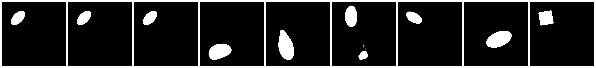
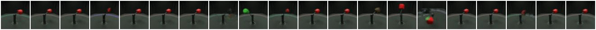

# Disentanglement-PyTorch
Pytorch Implementation of **Disentanglement** algorithms for Variational Autoencoders. This library was developed as a contribution to the ***[Disentanglement Challenge of NeurIPS 2019](https://aicrowd.com/challenges/neurips-2019-disentanglement-challenge)***.

If the library helped your research, consider citing the corresponding submission of the NeurIPS 2019 Disentanglement Challenge:

    @article{abdiDisentanglementPytorch,
        Author = {Amir H. Abdi and Purang Abolmaesumi and Sidney Fels},
        Title = {Variational Learning with Disentanglement-PyTorch},
        Year = {2019},
        journal={arXiv preprint arXiv:1912.05184},    
    }

The following algorithms are implemented:
- VAE
- β-VAE ([Understanding disentangling in β-VAE](https://arxiv.org/pdf/1804.03599.pdf))
- Info-VAE ([InfoVAE: Information Maximizing Variational Autoencoders](https://arxiv.org/abs/1706.02262))
- Beta-TCVAE ([Isolating Sources of Disentanglement in Variational Autoencoders](https://arxiv.org/abs/1802.04942))
- DIP-VAE I & II ([Variational Inference of Disentangled Latent Concepts from Unlabeled Observations ](https://openreview.net/forum?id=H1kG7GZAW))
- Factor-VAE ([Disentangling by Factorising](https://arxiv.org/pdf/1802.05983.pdf))
- CVAE ([Learning Structured Output Representation using Deep Conditional Generative Models](https://papers.nips.cc/paper/5775-learning-structured-output-representation-using-deep-conditional-generative-models.pdf))
- IFCVAE ([Adversarial Information Factorization](https://arxiv.org/pdf/1711.05175.pdf))

***Note:*** *Everything* is modular, you can mix and match neural architectures and algorithms.
Also, multiple loss terms can be included in the `--loss_terms` argument, each with their respective 
weights. This enables us to combine a set of disentanglement algorithms for representation learning. 

### Requirements and Installation

Install the requirements: `pip install -r requirements.txt` \
Or build conda environment: `conda env create -f environment.yml`

The library visualizes the ***reconstructed images*** and the ***traversed latent spaces*** and saves them as static frames as well as animated GIFs. It also extensively uses the web-based Weights & Biases toolkit for logging and visualization purposes.

### Training

    python main.py [[--ARG ARG_VALUE] ...]

or

    bash scripts/SCRIPT_NAME
    
#### Flags and Configs

- `--alg`: The main formulation for training. \
  ***Values**: 
AE (AutoEncoder), 
VAE (Variational AutoEncoder), 
BetaVAE, 
CVAE (Conditional VAE), 
IFCVAE (Information Factorization CVAE)*

- `--loss_terms`: Extensions to the VAE algorithm 
are implemented as plug-ins to the original forumation. 
As a result, if the loss terms of two learning algorithms (*e.g.*, A and B) 
were found to be compatible, they can simultaneously be included in the objective 
function with the flag set as `--loss_terms A B`. 
The `loss_terms` flag can be used with VAE, BetaVAE, CVAE, and 
IFCVAE algorithms. \
   ***Values**: FACTORVAE, DIPVAEI, DIPVAEII, BetaTCVAE, INFOVAE*
    
- `--evaluation_metric`: Metric(s) to use for disentanglement evaluation (see `scripts/aicrowd_challenge`). \
***Values**: mig, sap_score, irs, factor_vae_metric, dci, beta_vae_sklearn*

For the complete list of arguments, please check the [source](./common/arguments.py).
 

### Data Setup
To run the scripts:

1- Set the `-dset_dir` flag or the `$DISENTANGLEMENT_LIB_DATA` environment variable to the directory 
holding all the datasets (the former is given priority). 

2- Set the `dset_name` flag or the `$DATASET_NAME` environment variable to the name of the dataset (the former is given priority).
The supported datasets are: 
[celebA](http://mmlab.ie.cuhk.edu.hk/projects/CelebA.html),
[dsprites](https://github.com/deepmind/dsprites-dataset/raw/master/dsprites_ndarray_co1sh3sc6or40x32y32_64x64.npz)
(and the Deppmind's variants: color, noisy, scream, introduced [here](https://github.com/google-research/disentanglement_lib/blob/master/disentanglement_lib/data/ground_truth/named_data.py)),
[smallnorb](https://cs.nyu.edu/~ylclab/data/norb-v1.0-small/), 
[cars3d](http://www.scottreed.info/files/nips2015-analogy-data.tar.gz), 
[mpi3d_toy](https://storage.googleapis.com/disentanglement_dataset/data_npz/sim_toy_64x_ordered_without_heldout_factors.npz), and 
[mpi3d_realistic](https://storage.googleapis.com/disentanglement_dataset/data_npz/sim_realistic_64x_ordered_without_heldout_factors.npz), and
[mpi3d_real](https://storage.googleapis.com/disentanglement_dataset/Final_Dataset/mpi3d_real.npz).

Please check the [repository](https://github.com/rr-learning/disentanglement_dataset)
 for the mpi3d datasets for license agreements
and consider citing their work.

<!--- [shapes3d](https://storage.cloud.google.com/3d-shapes/3dshapes.h5)*.-->
 
Currently, there are two dataloaders in place: 
- One handles labels for semi-supervised and conditional (class-aware) training (*e.g.* CVAE, IFCVAE) , 
but only supports the *celebA* and *dsprites_full* datasets for now. 
- The other leverages Google's implementations of [disentanglement_lib](https://github.com/google-research/disentanglement_lib),
and is based on the starter kit of the 
[Disentanglement Challenge of NeurIPS 2019](https://github.com/AIcrowd/neurips2019_disentanglement_challenge_starter_kit/blob/master/utils_pytorch.py),
hosted by [AIcrowd](http://aicrowd.com).

### NeurIPS 2019 Disentanglement Challenge
To use this code in the 
[NeurIPS 2019 Disentanglement Challenge](https://www.aicrowd.com/challenges/neurips-2019-disentanglement-challenge)

- Run `source train_environ.sh NAME_OF_DATASET_TO_TEST`
- Set `--aicrowd_challenge=true` in your bash file
- Use `--evaluate_metric mig sap_score irs factor_vae_metric dci` 
to assess the progression of disentanglement metrics during training. 
- Set the last line of `run.sh` to your highest performing configuration.
- Follow the instructions on this [starter kit](https://github.com/AIcrowd/neurips2019_disentanglement_challenge_starter_kit)
to setup your AIcrowd and gitlab credentials and keys, and push the source code 
to your repository on GitLab.

### Sample Results

| Method    | Latent traversal visualization  | 
| ----- | -----|
| VAE |  |
| FactorVAE |  |
| CVAE (conditioned on shape)|   Right-most item is traversing the condition |
| IFCVAE (factorized on shape)|   Right-most factor is enforced to encode the shape |
| BetaTCVAE |  |
| VAE |  |

### Contributions
Any contributions, especially around implementing more disentanglement algorithms, 
are welcome. Feel free to submit bugs, feature requests, or questions as issues,
or contact me directly via email at: [amirabdi@ece.ubc.ca](mailto:amirabdi@ece.ubc.ca)

